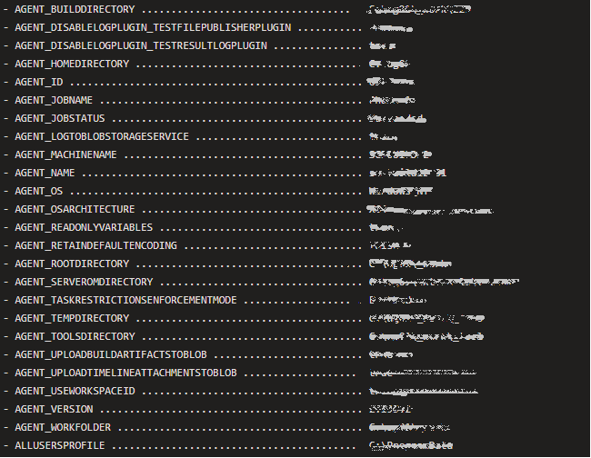

# Environment-Variables - Version 1.*

The purpose of this task is to print the environment variable to the build console.
If there is an error during the build process, it will print the environment variable on post-job, but if the checkbox "Print on Post job" selected it will print the details each time.

The task work on multiplatform and tested on Windows & Linux & Mac.

